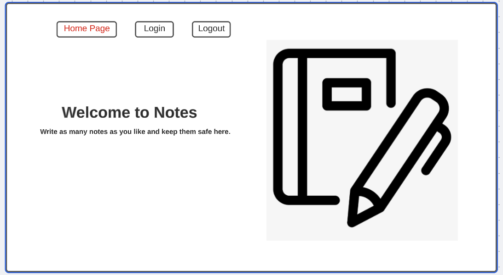
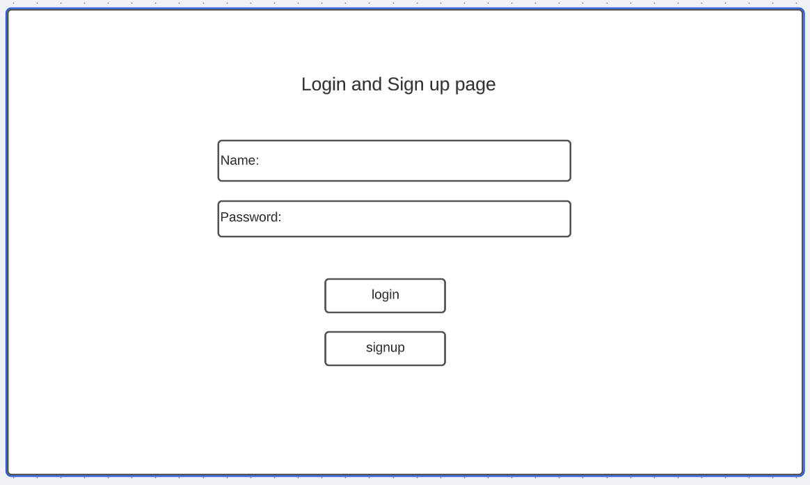
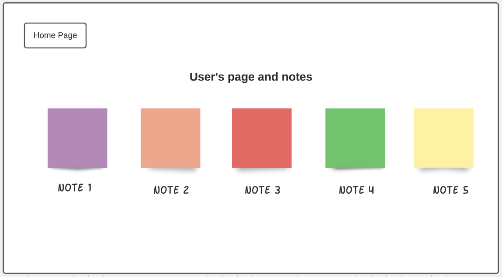
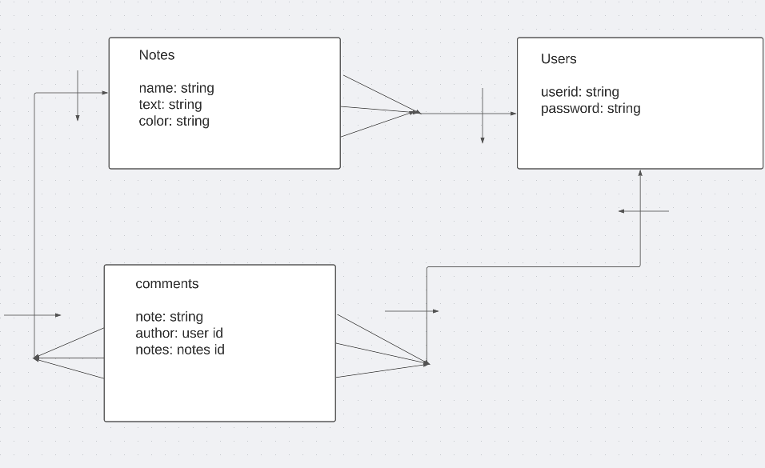

# Taking Note Webpage

# User Story

- This is a note based website application which will give people to sign up and be able to creat notes and save them to check them whenever they want.

# Technologies Used

1. HTML5
2. CSS
3. Java Script
4. Node and it's packages
5. Mongoose/MongoDB
6. Express


# User Stories
```
As a user I want the ability to:
-sign up
-log in
-log out
-Create notes
-Be able to write and edit these notes
-Delete the notes I need to be deleted.
-Make some notes public for other to comment on.
-Be able to comment on other's notes.
````
## Layout

1. Home Page



2. Signup/Login Page



3. Notes Page



4. ERD




#### NOTES

| **URL**          | **HTTP Verb**|**Action**|
|------------------|--------------|----------|
| /notes/         | GET          | index  
| /notes/:id      | GET          | show       
| /notes/new      | GET          | new   
| /notes          | POST         | create   
| /notes/:id/edit | GET          | edit       
| /notes/:id      | PATCH/PUT    | update    
| /notes/:id      | DELETE       | destroy  

#### Adding notes

| **URL**          | **HTTP Verb**|**Action**|
|--------------------|--------------|----------|
| /comments/:notesId | POST         | create  
| /comments/delete/:notesId/:commentId      | DELETE          | destroy       


#### Users

| **URL**          | **HTTP Verb**|**Action**|
|------------------|--------------|----------|
| /users/signup    | GET         | new  
| /users/signup    | POST         | create  
| /users/login     | GET         | login       
| /users/login     | POST         | create       
| /users/logout    | DELETE       | destroy   
